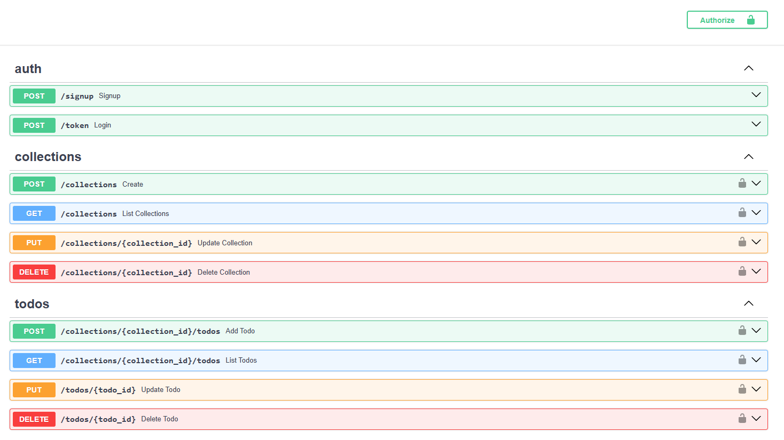

# Simple-Todo-FastAPI
## How to Install:

```bash
python -m venv venv
```

```bash
venv\Scripts\activate
```

```bash
pip install -r requirements.txt
```

## How to RUN:
```bash
venv\Scripts\activate
```

```bash
uvicorn app.main:app --reload
```

# Screen shots:
